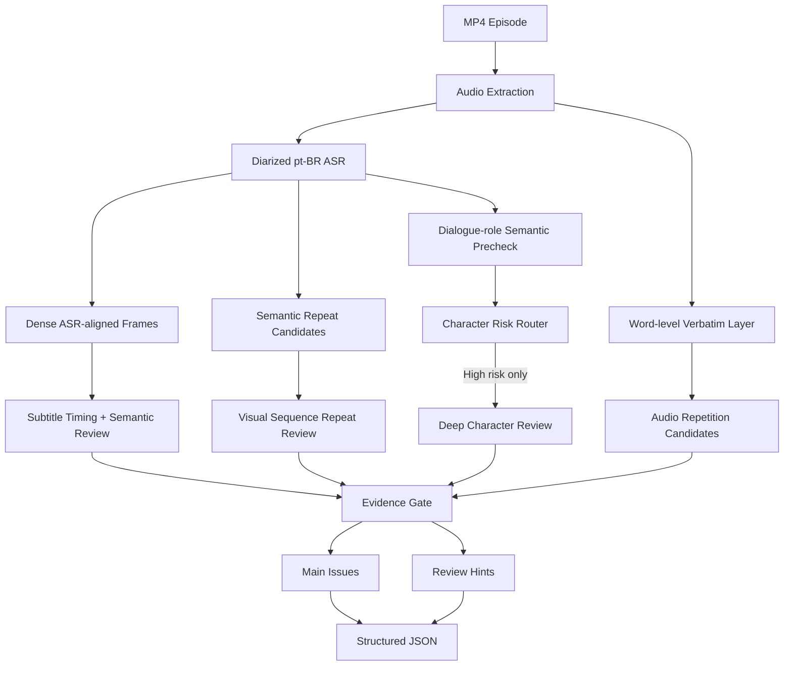

# 🎬 AI Short Drama Localization QA Assistant

A **human-in-the-loop multimodal QA assistant** for overseas short-drama localization, built around a Brazil / **pt-BR** workflow.

It converts long-form manual review SOPs into a structured pipeline that combines audio transcription, subtitle timing/semantic alignment, repetition detection, visual reasoning, character identity checks, and an Evidence Gate that separates **Main Issues** from **Review Hints**.

> **Status:** Step 5I.2 Final — frozen MVP pilot baseline.

## Why this project

Manual episode-by-episode localization QA is slow and difficult to scale when a drama contains dozens of episodes. The goal of this MVP is not to replace human reviewers, but to reduce the amount of video they must inspect manually by surfacing high-value timestamps and evidence first.

## What it checks

- Subtitle / dubbing semantic mismatch
- Partial missing subtitles and subtitle timing drift
- Word / phrase audio repetition
- Repeated plot or action sequences
- Proper-noun spelling / pronunciation inconsistencies
- Character identity drift, face swap / face mix
- Dialogue-role misattribution
- Other visual / dialogue logic anomalies routed through the QA rule engine

## Architecture



A key product decision is the **risk-triggered character cascade**: character precheck is always on, but expensive deep multimodal review runs only for suspicious windows.

## Pilot evaluation

The frozen Step 5I.2 baseline was evaluated on a small formal pilot using **blind human review first**, then AI review, then issue-level matching.

| Metric | Pilot result |
|---|---:|
| Formal pilot episodes | 4 |
| Blind human GT issues | 5 |
| System-level recall | **100% (5/5)** |
| Main-table recall | **60% (3/5)** |
| P0/P1 critical recall | **100% (5/5)** |
| Main issue precision | **100% (4/4)** |
| AI-only confirmed discoveries | **4** |
| Human workload reduction | **~90%** |
| Human review speed-up | **~10×** |

**Important:** this is MVP pilot validation on a small sample, not a production-scale accuracy claim. Two blind GT issues were detected in auxiliary modules but did not reach the final Main Issues surface, so the next product improvement is **evidence routing/orchestration**, not simply adding more detectors.

See [`docs/PILOT_RESULTS.md`](docs/PILOT_RESULTS.md) for the evaluation protocol and caveats.

## Run locally

```bash
python3 -m pip install -r requirements.txt
python3 -m streamlit run app.py
```

Paste your OpenAI API key in the sidebar. The key is used only for the current session and is not written to project files.

## Portfolio demo

A synthetic, API-free demo is included:

```bash
python3 -m streamlit run portfolio_demo.py
```

This is the recommended entrypoint for a **public portfolio deployment** because it contains no production video, no proprietary character assets, and no API credentials.

## Full private deployment

The full `app.py` can also read `OPENAI_API_KEY` from Streamlit secrets. For a private deployment, keep the repository/app private and configure the secret in the deployment platform rather than committing it.

See [`docs/DEPLOYMENT.md`](docs/DEPLOYMENT.md).

## Repository structure

```text
.
├── app.py                         # Full QA application
├── portfolio_demo.py              # API-free synthetic portfolio demo
├── media_pipeline.py              # Audio extraction + diarized ASR
├── dense_temporal_pipeline.py     # ASR-aligned frame extraction
├── dense_temporal_review.py       # Subtitle timing + semantic mismatch
├── verbatim_audio.py              # Word-level repetition layer
├── scene_repeat_pipeline.py       # Semantic repeat candidate ranking
├── scene_repeat_review.py         # Visual/action repeat review
├── character_risk_router.py       # Dialogue-aware character precheck/router
├── character_identity_review.py   # Deep character / face-mix review
├── rules/qa_rules.json            # Structured QA rule engine
├── schemas/                       # Input/output JSON schemas
├── demo/sample_result.json        # Synthetic portfolio example
└── docs/                          # Architecture, pilot, deployment, history
```

## Design principles

1. **Precision first.** Uncertain findings go to Review Hints instead of being forced into the Main Issues table.
2. **Human-in-the-loop.** The system surfaces evidence; the human reviewer remains the final production decision-maker.
3. **Temporal evidence matters.** Uniform keyframes are not enough for subtitle timing or role continuity.
4. **Speaker labels are not identities.** ASR Speaker A/B/C labels are treated only as voice clusters.
5. **Use semantic context for character QA.** Face-mix detection combines reference faces with dialogue-role and relationship semantics; character names are helpful but not required.
6. **Freeze before evaluation.** T003–T006 were run against the same frozen baseline without per-sample tuning.

## Privacy / portfolio note

Production drama videos, character assets, private documents, and API credentials are intentionally excluded from the public repository. The included demo data is synthetic.

## Limitations / next iteration

- Small pilot sample; more titles and genres are needed for production claims.
- Auxiliary findings do not always reach the final Main Issues surface.
- Character reference management should evolve into a drama-level library shared across all episodes.
- Batch-series orchestration and persistent evaluation storage are future productization steps.

---

Built as an MVP to explore how multimodal LLM workflows can turn a manual localization QA SOP into an auditable, evidence-based review pipeline.
